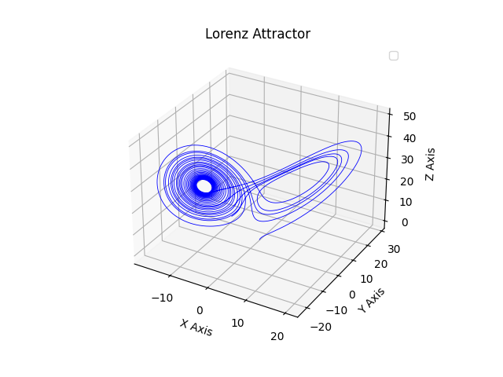
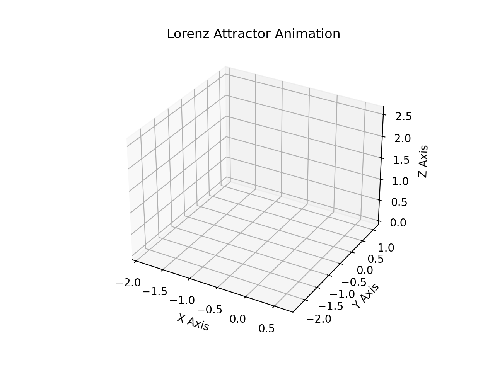
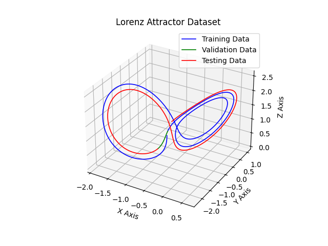

---

# Deep Kalman Filters (DKF) Implementation

This repository contains an implementation of **Deep Kalman Filters (DKF)** and its variants, including **Autoregressive Deep Kalman Filters (AR-DKF)**, **Forward Autoregressive Deep Kalman Filters (FAR-DKF)**, and **Bidirectional Autoregressive Deep Kalman Filters (BAR-DKF)**. These models are inspired by the paper [Deep Kalman Filters](https://arxiv.org/pdf/1511.05121) and are designed to model time series data with latent variables. The implementation includes training, evaluation, and prediction functionalities, and the models are tested on synthetic datasets such as the **Lorenz attractor** and **sine waves**.

---

## Table of Contents

1. [Overview](#1-overview)
2. [Folder Structure](#2-folder-structure)
3. [Dependencies](#3-dependencies)
4. [Getting Started](#4-getting-started)
5. [Usage](#5-usage)
6. [Models](#6-models)
7. [Datasets](#7-datasets)
8. [Training and Evaluation](#8-training-and-evaluation)
9. [Configuration Files](#9-configuration-files)
10. [Checkpoints](#10-checkpoints)
11. [Visualization](#11-visualization)
12. [References](#12-references)
13. [Contributing](#13-contributing)
14. [License](#14-license)

---

## 1. Overview

The **Deep Kalman Filter (DKF)** is a probabilistic model that combines the principles of Kalman filtering with deep learning. It is particularly useful for modeling time series data with latent variables. This implementation extends the DKF with several variants:

- **AR-DKF**: Incorporates autoregressive components to model dependencies on past observations.
- **FAR-DKF**: Adds a forward RNN for the encoder, enhancing the model's ability to capture temporal dependencies.
- **BAR-DKF**: Uses a bidirectional RNN to process sequences in both forward and backward directions, improving the model's ability to capture complex temporal patterns.

The models are trained and evaluated on synthetic datasets, including the **Lorenz attractor** and **sine waves**. The results are visualized in the `Media` folder, showing predictions and training performance.

---

## 2. Folder Structure

The project is organized as follows:

```
.
├── Checkpoints/                    # Directory to store model checkpoints
│   ├── lorenz_attractor_ar_dkf.pth
│   ├── lorenz_attractor_dkf.pth
│   ├── sine_wave_ar_dkf.pth
│   └── sine_wave_dkf.pth
├── Config/                         # Configuration files for models and training
│   ├── models_conf.yaml            # Configuration file for model parameters
│   └── training_conf.yaml          # Configuration file for training parameters
├── LICENSE                         # MIT License file
├── Media/                          # Visualizations and animations
├── Models/                         # Model implementations
│   ├── README.md                   # Documentation for the Models folder
│   ├── ar.py                       # Autoregressive model implementation
│   └── dkf_models.py               # Core DKF models implementation
├── Notebooks/                      # Jupyter notebooks for interactive use
│   ├── Tests/
│   ├── lorenz_attractor.ipynb      # Lorenz attractor data generation and visualization
│   ├── main.ipynb                  # Notebook for training and evaluating models interactively
│   └── nested_monte_carlo.ipynb    # Notebook for Nested Monte Carlo simulations
├── README.md                       # This file
├── Tests/                          # Directory for test runs and outputs
├── Utils/                          # Utility functions and tools
│   ├── config_loader.py            # Utility for loading configuration files
│   ├── loss_fcts.py                # Loss functions for training
│   ├── model_fcts.py               # Utility functions for model building and training
│   └── tools.py                    # Utility functions for data handling and visualization
├── main.py                         # Main script for running the project
└── requirements.txt                # List of dependencies
```

---

## 3. Dependencies

- Python 3.8 or higher
- PyTorch 1.12 or higher
- NumPy
- Matplotlib
- Seaborn
- Scikit-learn
- Pandas
- IPython (for Jupyter notebooks)

Install the required packages using:

```bash
pip install -r requirements.txt
```

---

## 4. Getting Started

### Installation

1. Clone the repository:

   ```bash
   git clone https://github.com/CL-BZH/deep-kalman-filters.git
   cd deep-kalman-filters
   ```

2. Install dependencies:

   ```bash
   pip install -r requirements.txt
   ```

### Running the Main Script

To train and evaluate the models, run the `main.py` script with desired arguments:

```bash
python main.py --dataset lorenz --train_seq_len 100 --test_seq_len 30 --noise_var 0.006 --num_epochs 100
```

For a full list of available arguments and their descriptions, run:

```bash
python main.py --help
```

---

## 5. Usage

### 1. Data Generation

The project provides functions to generate synthetic time series data, such as sine waves and Lorenz attractors. These functions are useful for testing and validating models.

### 2. Data Normalization

Normalize your data using the `normalize_data` function. This is essential for preprocessing data to ensure that it is on a similar scale, which can improve model training.

### 3. Model Training

Train your model using the `train_model` function. This function handles the training loop, including loading the data, initializing the optimizer, and saving the model checkpoint.

### 4. Model Evaluation

Evaluate your model using the `evaluate_model` function. This function computes metrics such as Mean Squared Error (MSE) for noise, reconstruction, and prediction.

### 5. Visualization

The project includes several visualization functions to help you analyze and compare model performance.

---

## 6. Models

### Deep Kalman Filter (DKF)

The DKF model is a probabilistic model that combines the principles of Kalman filtering with deep learning. It is designed to model time series data with latent variables.

### Autoregressive Deep Kalman Filter (AR-DKF)

The AR-DKF extends the DKF by incorporating autoregressive components, making it suitable for modeling time series with dependencies on past observations.

### Forward Autoregressive Deep Kalman Filter (FAR-DKF)

The FAR-DKF adds a forward RNN for the encoder, enhancing the model's ability to capture temporal dependencies.

### Bidirectional Autoregressive Deep Kalman Filter (BAR-DKF)

The BAR-DKF uses a bidirectional RNN to process sequences in both forward and backward directions, improving the model's ability to capture complex temporal patterns.

For more details about the models and their components, refer to the [Models/README.md](Models/README.md) file.

---

## 7. Datasets

### Sine Wave

A simple synthetic dataset generated using `Utils.tools.generate_sine_wave()` to which Gaussian noise is added.

### Lorenz Attractor

A synthetic time series dataset generated using `Utils.tools.generate_lorenz_data()` to which Gaussian noise is added. The Lorenz attractor is a chaotic system that exhibits complex, non-repeating behavior.

Below is a plot of the Lorenz attractor generated with **10,000 points**:



Below is an animation of the part of the Lorenz attractor curve used as the dataset:



The plot below shows an example of the different parts of the dataset that are used for training, validation, and testing the DKF and AR-DKF models:



---

## 8. Training and Evaluation

### Training

The models are trained using the following steps:
1. Load the dataset (sine wave or Lorenz attractor).
2. Normalize the data.
3. Split the data into training, validation, and test sets.
4. Train the model using the specified loss function.

### Evaluation

The trained models are evaluated on the test set for both **reconstruction** and **prediction** tasks. The evaluation is performed by computing the **Mean Squared Error (MSE)** between the model's output and the **ground truth signal** (i.e., the original signal before Gaussian noise was added).

- **Reconstruction**: The model is tasked with reconstructing the input sequence from the latent representation. The MSE is computed between the reconstructed signal and the ground truth signal.
- **Prediction**: The model predicts future time steps based on the input sequence. The MSE is computed between the predicted signal and the ground truth signal.

The results of the evaluation are visualized in the `Media` folder, showing the performance of the DKF and AR-DKF models on both tasks.

---

## 9. Configuration Files

### `models_conf.yaml`

This file contains configuration parameters for the models, such as the number of layers, hidden units, and other architectural details.

### `training_conf.yaml`

This file contains training hyperparameters such as learning rate, batch size, and number of epochs.

These files are located in the `Config` directory and can be customized as needed.

---

## 10. Checkpoints

Saved model weights are stored in the `Checkpoints` directory. Example filenames:

- `lorenz_attractor_dkf.pth`
- `sine_wave_ar_dkf.pth`

---

## 11. Visualization

### Media Folder

- **Test_1/Lorenz_attractor**: Predictions and training performance for the Lorenz attractor dataset.
- **Test_1/Sine**: Predictions and training performance for the sine wave dataset.
- **lorenz_attractor.gif**: Animation of the Lorenz attractor generated from model predictions.

---

## 12. References

- Rahul G. Krishnan, Uri Shalit, David Sontag, "Deep Kalman Filters," arXiv:1511.05121 [cs, stat], [Submitted on 16 Nov 2015 (v1), last revised 25 Nov 2015 (this version, v2)]. [Online]. Available: https://arxiv.org/pdf/1511.05121.

---

## 13. Contributing

Contributions are welcome! Please follow these guidelines:

1. Fork the repository.
2. Create a new branch for your feature or bug fix.
3. Commit your changes.
4. Submit a pull request.

---

## 14. License

This project is licensed under the MIT License. See the [LICENSE](LICENSE) file for details.

---

